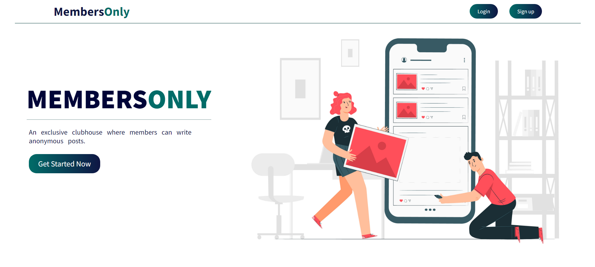
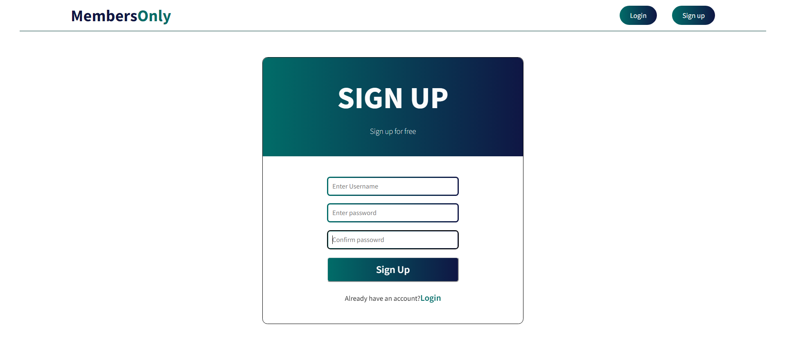
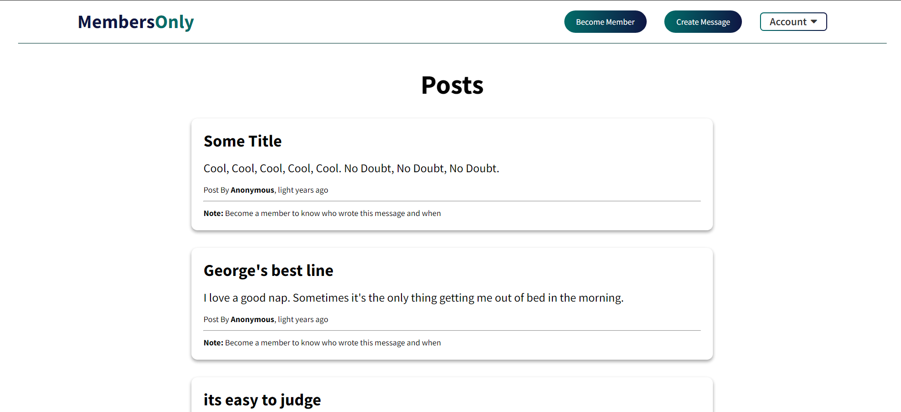
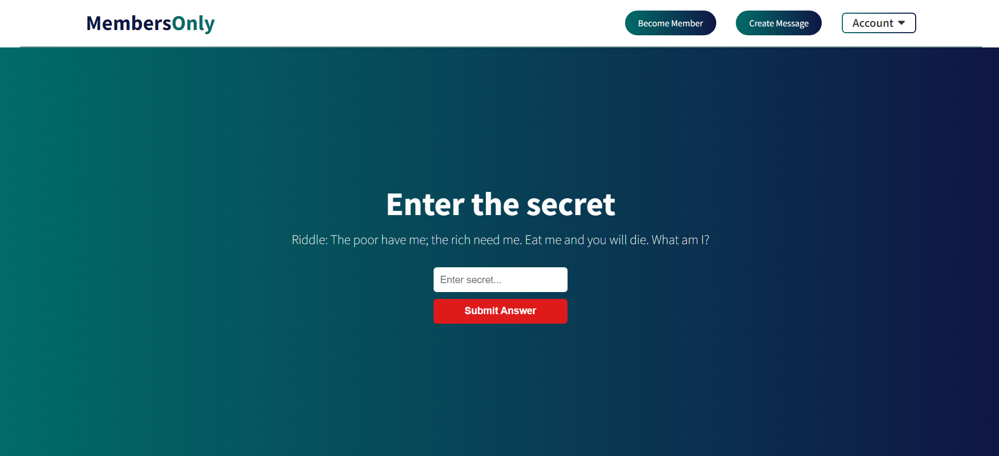

# Members Only

An exclusive clubhouse where your members can write anonymous posts. Inside the clubhouse, members can see who the author of a post is, but outside they can only see the story and wonder who wrote it.

## Features

- User Authentication

## Technologies

- Node.js
- Babel
- Mongoose
- Express
- PassportJS
  -Pug

## Getting Started

### Prerequisites

- Node.js (version 14 or newer)
- npm

### Installation

1.  Clone this repository: `git clone https://github.com/Adarshkumar03/members-only.git`
2.  Navigate to moodspace: `cd members-only`
3.  Install Dependencies: `npm install`

### .env

Create a .env file. It should have the following fields

```
MONGO_DEV_URI=your_mongodb_uri
MEMBERSHIP=Nothing
ADMIN_NAME=any_username
PORT=any_port
```

### Development Mode

1.  Start the Vite develpment server: `npm start`

## Screenshots

### Home Page



### Sign-Up Page



### Home Page



### Membership


